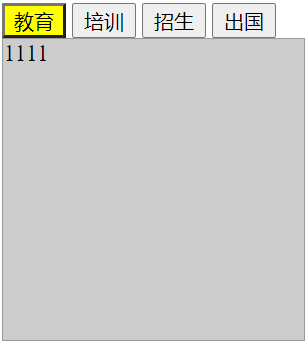

[toc]

行为、样式、结构分离

html中怎么写js就怎么写

## js参数传递 ##

注意：

变量的定义要在函数内部，在外部定义是无法读取的，这点和python好像不太一样，可能没有

全部变量的概念

懒在编程中是优点，减少重复的代码，增加代码的复用

1. 传单个参数

```html
     <style>
        div{
            width: 150px;
            height: 150px;
            background-color: red;
        }
    </style>
    <script>
        function setcolor(color){
            var oDiv=document.getElementById("div1")
            oDiv.style.background=color;
            // 属性操作第二种方法
            // oDiv.style['background']=color;
        }
    </script>
</head>
<body>
    <input type="button" value="变绿" onclick="setcolor('green')"/>
    <input type="button" value="变黄" onclick="setcolor('yellow')">
    <input type="button" value="变黑" onclick="setcolor('black')">
    <div id="div1"></div>
</body>
```

2. 传多个参数

```html
function setStyle(name, value)
{
	var oDiv=document.getElementById('div1');	
	oDiv.style[name]=value;
}
```

## while写法

```html
    var i=0 
    while(i<5){
        alert(i);
        i++
    }
```

## for循环写法

```html
    <script>
        for(var i=0;i<5;i++){
            alert(i)
        }
    </script>
```

## 提取行间事件

行间提取事件第一种方法：

function 名字（）

{

　　...

}

oBtn.onclick=名字；

第二种方法：

oBtn.onclick=function ()

{

　　...

}

其实在js当中，大部分的函数都是没有名字的，直接使用第二种方法。

## 数组定义

```html
var arr=[1,2,3,4];
```

## 字符串串联

```html
'abc'+(12+5)+'def';
```


## 方法总结

getElementsByTagName() 方法可返回带有指定标签名的对象的集合

```html
<script>
    // 等页面加载完调用函数
    // function(){}匿名函数
window.onload=function ()
{
	var aDiv=document.getElementsByTagName('div');
	aDiv[0].style.background='red';
	aDiv[1].style.background='red';
	aDiv[2].style.background='red';
	aDiv[3].style.background='red';
};
```

## 全选、不选、反选

```html
<script>
        // 套windon.onload确保浏览加载完在执行js不然可能会报错
        window.onload=function (){
        // 通过ID拿到操作的标签后面用匿名函数方式提取
        // 行间事件
        var oBtn1=document.getElementById('btn1')
        var oBtn2=document.getElementById('btn2')
        var oBth3=document.getElementById('btn3')
        var oDiv=document.getElementById('div1')
        var aCh=oDiv.getElementsByTagName('input')
        // 全选
        oBtn1.onclick=function(){
            for(var i=0;i<aCh.length;i++)
            {
                aCh[i].checked=true;
            }
        } 
        // 不选
        oBtn2.onclick=function(){
            for(var i=0;i<aCh.length;i++)
            {
                aCh[i].checked=false
            }
        }
        // 反选
        oBth3.onclick=function()
        {
            for(var i=0;i<aCh.length;i++)
            {
                if(aCh[i].checked==true)
                {
                    aCh[i].checked=false
                }
                else
                {
                    aCh[i].checked=true
                }
            }
        }
    }
    </script>
</head>
<body>
    <input id="btn1" type="button" value="全选" >
    <input id="btn2" type="button" value="不选" >
    <input id="btn3" type="button" value="反选" ><br>
    <div id="div1">
        <input type="checkbox"><br>
        <input type="checkbox"><br>
        <input type="checkbox"><br>
        <input type="checkbox"><br>
        <input type="checkbox"><br>
        <input type="checkbox"><br>
        <input type="checkbox"><br>
        <input type="checkbox"><br>
        <input type="checkbox"><br>
        <input type="checkbox"><br>
        <input type="checkbox"><br>
    </div>
```

## 选项卡



```html
<style>
        #div1 .active {background:yellow;}
        #div1 div {width:200px; height:200px; background:#CCC; border:1px solid #999; display:none;}
    </style>
    <script>
        window.onload=function(){
            var oDiv=document.getElementById('div1')
            var aBtn=oDiv.getElementsByTagName('input')
            var aDiv=oDiv.getElementsByTagName('div')
            for(var i=0;i<aBtn.length;i++){
                aBtn[i].index=i;
                aBtn[i].onclick=function(){
                    for(var i=0;i<aBtn.length;i++){
                        aBtn[i].className='';
                        aDiv[i].style.display="none";
                    }
                    this.className='active';
                    aDiv[this.index].style.display="block"
                };
            }          
        }
    </script>
</head>
<body>
    <div id="div1">
        <input class="active" type="button" value="教育" />
        <input type="button" value="培训" />
        <input type="button" value="招生" />
        <input type="button" value="出国" />
        <div style="display:block;">1111</div>
        <div>2222</div>
        <div>333</div>
        <div>4444</div>
    </div>    
</body>
</html>
```

## JS与python基础语法对比

|          | python                                                     | javascript                                                   |
| -------- | ---------------------------------------------------------- | ------------------------------------------------------------ |
| 注释     | #                                                          | //                                                           |
| 变量     | a  = 3     a, b, c = 1, 2,3                                | var a = 3                                                    |
| 变量名   | 区分大小写                                                 | 区分大小写                                                   |
| 变量类型 | type(a)     str     int、float     bool                    | typeof(a)     String     Number     Boolean     Undefined Null NaN     Object( Array, Function, Date) |
| 类型转换 | str()     int() float()     list()                         | String()     Number()                                        |
| 加减乘除 | + - * /                                                    | + - * /                                                      |
| 整除     | a // b                                                     | parseInt( a / b )                                            |
| 模       | %                                                          | %                                                            |
| 乘方     | **                                                         | ^                                                            |
| 并       | and                                                        | &&                                                           |
| 或       | or                                                         | \|\|                                                         |
| 否       | not                                                        | !                                                            |
| 等于     | ==                                                         | ==                                                           |
| 不等于   | !=                                                         | !=                                                           |
| 一般语句 | ifxxxx:     pass     elifxxxx:     pass     else:     pass | if(xxxxx){     pass     }else if(xxxx){     pass     }else{     pass     } |
| 三元运算 | a  = b if True else c                                      | s = a>b ? 'yes' : 'no'                                       |

## 使用JS点击div产生随机背景色

```html
<script>
    window.onload=function(){
        var oDiv=document.getElementById('div1');
        oDiv.onclick=function(){
            oDiv.style.background="#"+("00000"+((Math.random()*16777215+0.5)>>0).toString(16)).slice(-6);                
        }            
    }

</script>
<style>
    div{
        width: 200px;
        height: 200px;
        border: solid;           
    }
</style>
</head>
<body>
<div id="div1">
    <p>我的世界我做主</p>
</div>

</body>>
```

## 使用JS获取节点的全部样式

```html
getStyle=window.getComputedStyle(oDiv,null);
```

?为什么只能获取js内定义的div的css样式？

## 如何判断JS变量类型?

**typeof()**

## 几种字符串类型如何转数字类型的方法

parseInt(num); // 默认方式 (没有基数)

parseInt(num, 10); // 传入基数 (十位数)

parseFloat(num); // 浮点数

Number(num); // Number 构造器

~~num; //按位非

num / 1; 

num * 1; 

num -

\+num;

 ## 几种循环迭代的方法及之间区别

```html
for(var num = 1;num<10;num++){
               console.log(num);//1,2,3,4,5,6,7,8,9
              }
```

while先判断在循环 do while 先执行在判断

```html
var num = 1;//1、声明循环变量
            
while (num<10){//2、判断循环条件;
    console.log(num);//3、执行循环体操作；
    num++;//4、更新循环变量；
}
```

```html
var num = 10;            
do{
    console.log(num);
    num--;
    }while(num>=0);
            
   console.log(num);//-1
```

break:循环停止、continue：跳过本次循环

```html
for(var i=0;i<10;i++){
        if(i == 5){
            break;
        }
        console.log(i);//0,1,2,3,4
    }

    for(var i=0;i<10;i++){
        if(i == 5){
            continue;
        }
        console.log(i);//0,1,2,3,4,6,7,8,9
    }
```

## 将[1,2,3]和[“a”,“b”,“c”]合并的方法

方法1：

```html
        var a= [1,2,3]
        var b= ["a","b","c"]
        console.log(a.concat(b))
```

方法2：

```html
        var a= [1,2,3]
        var b= ["a","b","c"]
        for( var i in b)
        {
        a.push(b[i]);
        }
                console.log(a)   
```

## 制作一个页面时钟

http://js.jirengu.com/mocuq/1/

```html
<!DOCTYPE html>
<html>
<head>
<meta charset="UTF-8">
<title>网页时钟</title>
<style>
    *{
        margin:0px;
        text-align: center;
    }
    div p:nth-child(1){
        font-size: 100px;
    }
    .show{
        font-size: 50px;
    }

</style>
<script type="text/javascript">
    //判断时间是否为个位数，如果时间为个位数就在时间之前补上一个“0”
	function check(val) {
		if (val < 10) {
			return ("0" + val);
		} 
		else {
			return (val);
		}
	}
	function displayTime() {
		//获取div元素
		var timeDiv=document.getElementById("timeDiv");
		//获取系统当前的年、月、日、小时、分钟、毫秒
		var date = new Date();
		var year = date.toDateString().split(" ")[3];
		var month = date.toDateString().split(" ")[1];
		var eday = date.toDateString().split(" ")[0];
        var day = date.getDate();          
		var hour = date.getHours();
		var minutes = date.getMinutes();
        var second = date.getSeconds();
        var str;
        if (hour>12){
            hour -=12;
            str = "pm"
        }
        else{
            str="am"
        }  
        
		var timestr = "<p>"+check(hour)+ ":" + check(minutes) + ":" + check(second)+ str +"</p>"+"<br>"+"<p class="+"show>" +eday +","+month+" "+day +","+ year+"</p>";
		// //将系统时间设置到div元素中
		timeDiv.innerHTML = timestr;
	}
	//每隔1秒调用一次displayTime函数
	function start(){
        window.setInterval("displayTime()",1000)//单位是毫秒
}
</script>
</head>
<!--  body onload:当整个html页面加载完成后执行此函数  -->
<body onload="start();">
<div id="timeDiv"></div> 
</body>
</html>

```

## 使用原生JS制作一个TODOLIST 的日程计划表


## 如何防止事件冒泡

```html
function bubbles(e){
  var ev = e || window.event;
  if(ev && ev.stopPropagation) {
    //非IE浏览器
    ev.stopPropagation();
  } else {
    //IE浏览器(IE11以下)
    ev.cancelBubble = true;
  }  
}
```

## 使用https://dev.qweather.com/docs/api/ 的接口制作一个天气页面 分别显示当前城市名和天气状态