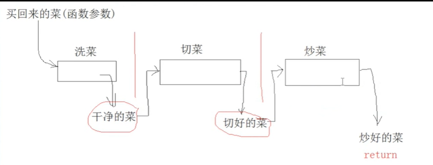
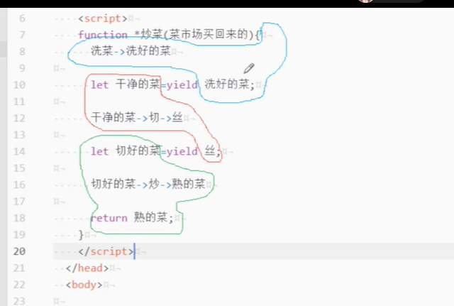

## 背景

1. **进程(process)/线程(thread)**

进程process： 电脑端安装很多的应用软件，每当运行一个应用程序，相当于开辟一个进程（而对于浏览器来说，

每新建一个页卡访问一个页面，都是新开辟一个进程）

任务管理器可以查看进程

线程thread： 每一个进程中可能还会同时做很多事情，如果程序中需要同时处理很多事情，则需要开辟多个线程

（一个线程同时只能做一个事情）

=> 一个进程中，会包含0~多个线程

理解：

每一个饭店是一个进程
饭店里面每一个点餐的服务员就是一个线程

2. **javascript是单线程的线程**

javascript是单线程执行，如果有多个任务就需等前个任务执行完成后，在执行下一个程序。如果1个任务执行时

间很长，就会造成浏览器的假死，导致整个页面卡在这个地方，其他任务无法执行。为了解决这个问题javascript    

语言讲任务分为同步和异步。


3. **回调函数**

在直接调用函数A()时，把另一个函数B()作为参数，传入函数A()里面，以此来通过函数A()间接调用函数B()

```js
//函数1
var test = function(abc){
    console.log(abc);
};
//函数1的调用
test('HelloWorld');

//函数2
var test = function(abc){
    abc('Helloworld');
};
//函数2的调用
test( function(words) {console.log(words);}  );
```

## 异步解决办法

### promise

1. 三种状态

- Pending----Promise对象实例创建时候的初始状态
- Fulfilled----可以理解为成功的状态
- Rejected----可以理解为失败的状态

2. 例子

```js
// Promise
const doPromise = new Promise((resolve, reject) => {
  setTimeout(() => {
    const skills = ['HTML', 'CSS', 'JS']
    if (skills.length > 0) {
      resolve(skills)
    } else {
      reject('Something wrong has happened')
    }
  }, 2000)
})

doPromise
  .then(result => {
    console.log(result)
  })
  .catch(error => console.log(error))
```

3.**Promise.all()**方法

所有需要跑的任务放进来？

```js
promise.all([进程1,进程2....]).then(result =>()).catch(error =>{})
```

### generator

Generator 函数是 ES6 提供的一种异步编程解决方案，语法行为与传统函数完全不同，Generator 最大的特点就

是可以控制函数的执行。

语法上，首先可以把它理解成，Generator 函数是一个状态机，封装了多个内部状态。

Generator 函数除了状态机，还是一个遍历器对象生成函数。

可暂停函数, **yield可暂停，next方法可启动**，每次返回的是yield后的表达式结果。

yield表达式本身没有返回值，或者说总是返回undefined。**next方法可以带一个参数，该参数就会被当作上一**

**个yield表达式的返回值**（通过next传参第一个是废的没法给yield传参，如果要传参通过传统的函数传参方法传参，yield也可以返回值）

```js
function *show(){}//Generator 函数名带*
```

例子伪代码：





例子：

```js
function *foo(x) {
  let y = 2 * (yield (x + 1))
  let z = yield (y / 3)
  return (x + y + z)//最后一步通过return返回值
}
let it = foo(5)
console.log(it.next())   // => {value: 6, done: false}
console.log(it.next(12)) // => {value: 8, done: false}
console.log(it.next(13)) // => {value: 42, done: true}
```

执行步骤：

1. 首先 Generator 函数调用和普通函数不同，它会返回一个迭代器
2. 当执行第一次 next 时，传参会被忽略，并且函数暂停在 yield (x + 1) 处，所以返回 5 + 1 = 6
3. 当执行第二次 next 时，传入的参数12就会被当作上一个yield表达式的返回值，如果你不传参，yield 永远返回 undefined。此时 let y = 2 * 12，所以第二个 yield 等于 2 * 12 / 3 = 8
4. 当执行第三次 next 时，传入的参数13就会被当作上一个yield表达式的返回值，所以 z = 13, x = 5, y = 24，相加等于 42

### Async/Await

一个函数如果加上 async ，那么该函数就会返回一个 Promise

```js
async function async1() {
  return "1"
}
console.log(async1()) // -> Promise {<resolved>: "1"}
```

使用promise的值，使用await关键字

```js
const square = async function (n) {
  return n * n
}
const value = await square(2) /// value值为4
```

```js
const fetchData = async () => {
  try {
    const response = await fetch(url)//response使用fetch(url)的返回值
    const countries = await response.json()//countries使用countries的返回值
    console.log(countries)
  } catch (err) {
    console.log(err)
  }
}
console.log('===== async and await')
fetchData()
```

注：当然async/await函数也存在一些缺点，因为 await 将异步代码改造成了同步代码，如果多个异步代码没有依

赖性却使用了 await 会导致性能上的降低，代码没有依赖性的话，完全可以使用 Promise.all 的方式。