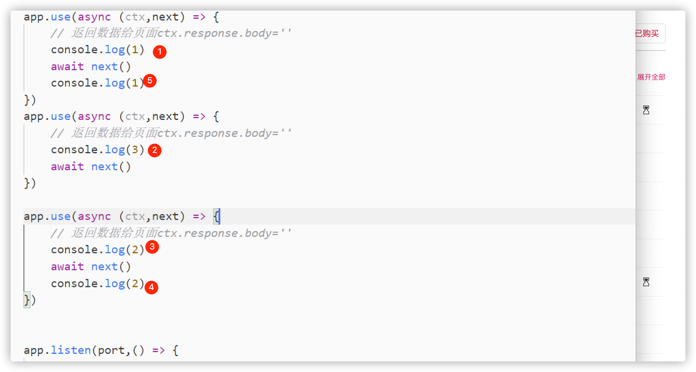
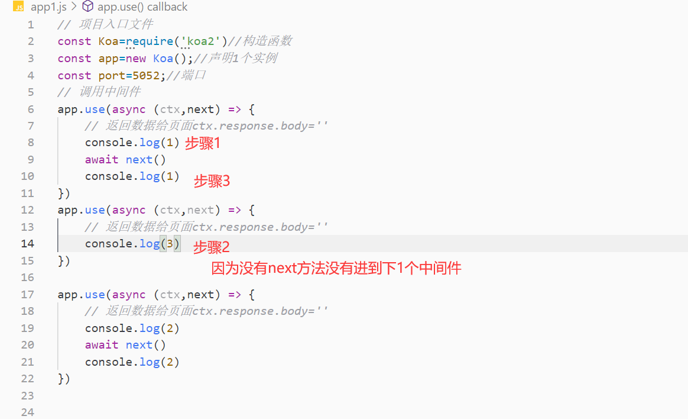
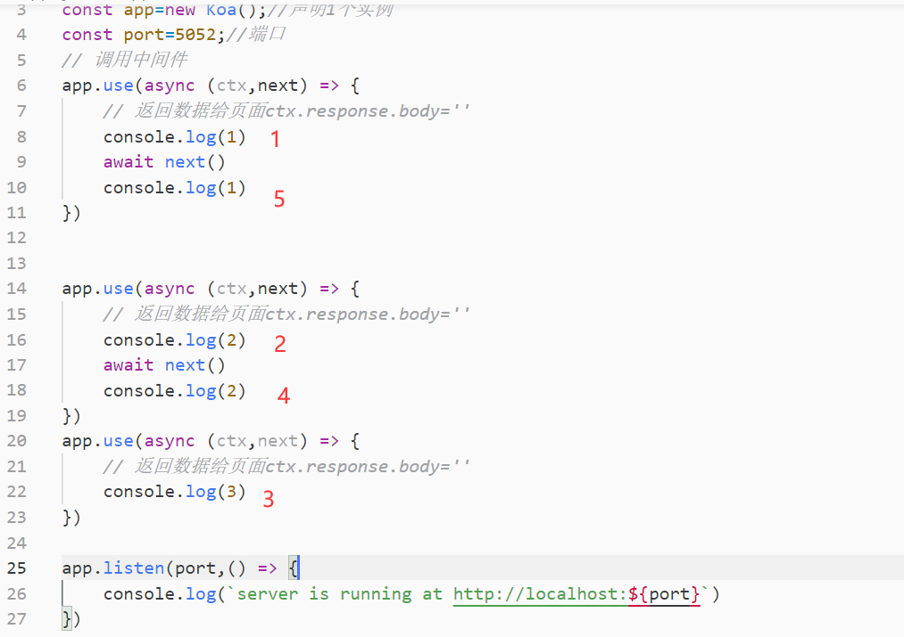

[toc]

### 入口文件编写

```js
// 项目入口文件
const Koa=require('koa2')//构造函数
const app=new Koa();//声明1个实例
const port=5050;//端口
// 调用中间件
app.use(async (ctx) => {
    // 返回数据给页面ctx.response.body=''简写ctx.body
    ctx.response.body='hello koa'
})
app.listen(port,() => {
    console.log(`server is running at http://localhost:${port}`)
})
```

### 洋葱模型

**app.use 一下就是把  函数 push 到上面的 list中**

例子1执行步骤：



例子2：



例子3：



### 路由中间件

```js
const Koa = require('koa2')
const Router = require('koa-router');
const app = new Koa();
const router = new Router();
const port = 9000;

router.get('/',async (ctx) => {
    ctx.body='首页';    
})

router.get('/list',async (ctx) => {
    ctx.body='列表页';    
})
//router.routes()启动路由
//router.allowedMethods()允许任何请求get post
app.use(router.routes(),router.allowedMethods())

app.listen(port,() => {
    console.log(`Servering is running at http://localhost:${port}`)
})
```

# pm2 管理 koa2

PM2（Process Manager 2 ）是具有内置负载均衡器的Node.js应用程序的生产运行时和进程管理器。它允许您永

久保持应用程序活跃，无需停机即可重新加载它们。也就是说，你平时在电脑上启动node程序后，只要编辑器一

关闭，程序就会被kill，而使用pm2之后他就可以一直保持在后台进程中，直到你使用pm2 kill，这个时候他才会

消失。