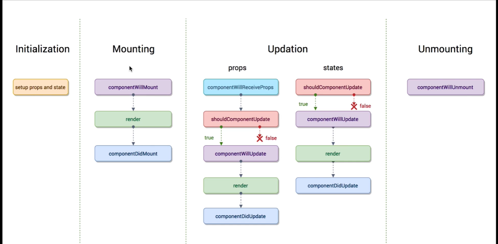

[toc]

## 知识点：

### Jsx

jsx不是html，JSX 被用来创建 React 当中的 Elements，React 当中的元素。然后 React 再通过一些方法，把 JSX 

创建的元素，渲染成我们在浏览器当中看到的 DOM元素。利用 Babel 一类的转译器来将我们的 JSX 语法或者 ES6 语法转译成浏览器可以直接运行的 JavaScript

关键点：

1. JSX 在嵌套时，最外层有且只能有一个标签
2. 在 JSX 当中的表达式需要用一个大括号括起来
3. ReactDOM 的 render 方法，将 title 元素渲染至 id 为 root 的页面容器当中

```JSX
const title = <h1>React Learning</h1>
// 这便是将 JSX元素渲染成 DOM 的方法 
ReactDOM.render(title,document.getElementById('root'))
```

```HTML
<div id="root"></div>
```

### 组件

#### 组件与元素

元素是构建React应用的最小单位。

组件的定义呢，是指在UI界面中，可以被独立划分的、可复用的、独立的模块。其实就类似于JS当中对function函数的定义，它一般会接收一个名为props的输入，然后返回相应的React元素，再交给ReactDOM，最后渲染到屏幕上。

#### 组件定义

1. 函数方式

   定义一个接收props传值，返回React元素的方法

   ```jsx
   function Title(props) {
     return <h1>Hello, {props.name}</h1>
   }
   ```

2. 类方式

   ```jsx
   class Title extends React.Component {
     render() {
       return <h1>Hello, {this.props.name}</h1>
     }
   }
   ```

#### 受控与非受控组件

受控：

一般涉及到表单时使用，用props或者state传值，用户交互使得state数据发生改变，绑定事件处理函数后，重新渲染组件，使得页面中的数据发生改变。

非受控：

ref React获取Dom元素

react并不推荐过度使用ref，如果能通过state做到的事情，就不应该使用 refs 在你的 app 中“让事情发生”。

过度使用ref并不符合数据驱动的思想

```jsx
<input> 
ref={(input) =>{this.input=input}}
</>
```

在React当中props其实是非常强大的，props几乎可以传入任何东西，变量、函数、甚至是组件本身：

### 组件数据

#### props

传入类型：变量 函数 组件 props.children

传值方式：

从写法上来看呢，我们为组件传入props就可以像为HTML标签添加属性一样,props都是自上向下传递，从父组件

传入子组件,props只只读的可以传入默认值

```jsx
const SimpleButton = props => 
    {/*<button style={{ color: props.color }}>Submit</button>*/}
    <button className={props.color}>Submit</button>
ReactDOM.render(<SimpleButton color="blue" />, document.getElementById('root'))
```

#### state

主要用途：初始化，setState，方法向下传递数据

在React中state也是我们进行数据交互的地方，又或者叫做state management状态管理。一个应用需要进行数据

交互，比如同服务器之间的交互，同用户输入进行交互。话反过来，从API获取数据，处理用户输入也就是我们需

要用到state的时候。

```jsx
//存数据
this.state={}
//改变数据
this.setState({})
```

### 组件数据生命周期



## 知识回顾

### React

#### jsx只支持表达式,表达式和语句的区别,有哪些是表达式哪些是语句?

1. 表达式是一组代码的集合，它返回一个值 。表达式返回的结果会相应地渲染到页面上。表达式用{}包裹。
2. 语句就是不会得到一个值，例如：if while for

#### 为什么在类组件中接受props需要在构造函数中使用super?

super 指代父类的构造函数，React 里面就是指代 React.Component 的构造函数

#### 深拷贝和浅拷贝的区别?

深拷贝：两个变量互相独立，指向的是不同的地址。好处是其中一个变量改变了，另外一个变量不受影响

浅拷贝：两个变量都是指向一个地址，改变了一个变量，另一个变量也随之改变。这也是浅拷贝带来的副作用，两个变量会相互影响到，因为它们指向同一个地址。

#### 如何定义props的默认值和类型?

默认值：组件名.defaultProps

类型检查：组件名.proTypres

#### 组件间传值的方法有哪些?

1. 父传子 使用 this.state.xx
2. 子传父 ，开发中常见的处理方式就是子组件调用父组件通过 `props` 传入的处理函数

#### React中 this的指向问题

那么我们为什么需要在react里bind(this)呢？ 简单来说，就是react在调用render方法的时候， 会先把render里的

方法赋值给一个变量（比如变量foo,onClick），然后再执行foo(),onClick()。 具体来说，以典型的绑定点击事件为

例：

```jsx
<div onClick={this.clickHandler}>测试</div>
```

react构建虚拟DOM的时候，会把this.clickHandler先赋值给一个变量(react 点击事件是 onClick)。我们假设是变

量clickFunc = this.clickHandler; 然后，把虚拟DOM渲染成真实DOM的时候，会把onClick属性值替换成onclick，

并给onclick赋值clickFunc在复杂的情况中，可能存在多次传递，如果不进行bind，那么this的指向是一定会丢失的。

#### React各生命周期使用场景

示意图：


componentWillMount()：页面加载前执行

componentDidMount()：页面加载后执行，向服务器请求数据可以发放在里面

componentWillUnmount ()：组件卸载时执行

componentWillReceiveProps (nextProps)：接受父组件数据改变时执行

shouldComponentUpdate(nextProps,nextState)：return false可以阻止组件的更新

componentWillUpdate (nextProps,nextState)：turn以后，组件进入重新渲染的流程

componentDidUpdate(prevProps,prevState)：组件更新完毕后，react只会在第一次初始化成功会进入

componentDidmount,之后每次重新渲染后都会进入这个生命周期

#### props 和 state的区别?

props :父组件给子组件传值，可以传变量、函数、组件、props.children

state：state是我们交互数据的地方，state数据发生变化REeact重新渲染页面

#### 如何确定划分组件的边界?

Do one thing and do it well！

其根本思想是弱化组件间的依赖关系，每个组件尽量保证独立，无论是业务组件还是基础组件，保证整个系统的的

低耦合度
